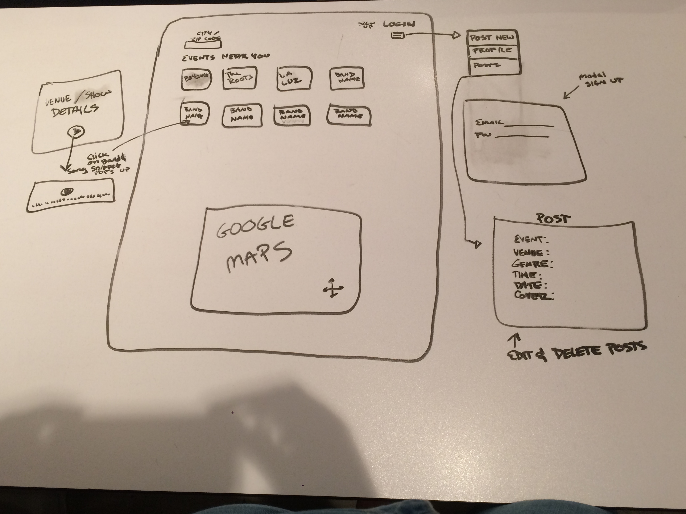
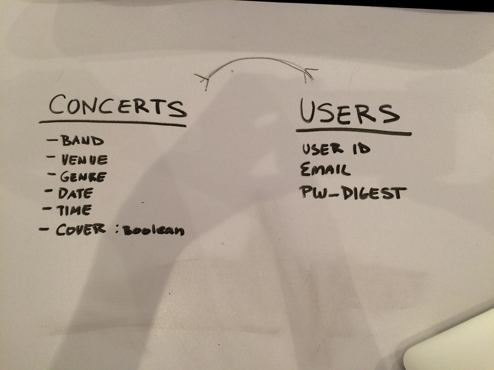

#Project 4
##Name TBD

####Idea Behind The Project
I would like to build a project where users can search out upcoming concerts in their area. I would also like for users to be able to post details about concerts/gigs they are having so artists without as much advertising power or who play smaller venues can spread the word about their shows.

####MVP
* Users can create profiles with log in and logout capabilities.
* Users can post gigs that their bands are having.
* Users can search for upcoming concerts that are in their area by city/zip.
* Users can click on a concert listing and view the details and play a song for the band on the listing.

#####Technologies I Plan on Using
* MEAN-Stack
* Mongo
* Express
* Angular
* Node   
* Mongoose 
* Git
* Github
* Heroku
* GoogleMaps API
* Song Kick API
* Sound Cloud API ?

#####Wire Frames

#####ERD

#####User Story

[Trello Link](https://trello.com/b/aLlvQgBP/project-4)
